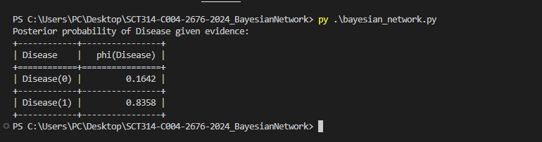

# JACOB KYULE
# SCT314-C004-2676/2024
# MSC COMPUTER SYSTEMS
# UNIT: ARTIFICIAL INTELLIGENCE

# Bayesian Network for Medical Diagnosis

## Introduction to Bayesian Networks
Bayesian Networks (BNs) are probabilistic graphical models representing a set of variables and their conditional dependencies via a directed acyclic graph (DAG). They combine principles from graph theory and probability theory to model uncertainty in complex domains. Each node in the graph corresponds to a random variable, and the edges indicate conditional dependencies. BNs enable reasoning under uncertainty by encoding joint probability distributions efficiently.

Bayesian Networks are widely used in artificial intelligence, especially for decision-making, diagnosis, and prediction, where information is incomplete or uncertain. They support inference, which involves computing the probability of unknown variables given observed evidence, thus assisting in intelligent decision support.

## 1. Problem Being Solved
This project models a simplified medical diagnosis system that estimates the probability of a patient having a disease based on observed symptoms and test results. The goal is to perform probabilistic reasoning under uncertainty using Bayesian Networks.

## 2. Chosen Domain and Tools
- **Domain:** Medical diagnosis focusing on disease prediction from symptoms and test outcomes.
- **Tools:** Python programming language with the `pgmpy` library for Bayesian Networks modeling and inference.

## 3. Network Design

The Bayesian Network includes four variables:

| Variable   | Description                         |
|------------|-----------------------------------|
| Disease    | Whether the patient has the disease (True/False) |
| Symptom1   | Presence of symptom 1 (e.g., fever) |
| Symptom2   | Presence of symptom 2 (e.g., cough) |
| TestResult | Diagnostic test result (Positive/Negative) |

### Structure:

  Disease
 /   |   \
Symptom1 Symptom2 TestResult


### Prior and Conditional Probabilities:

| Variable   | Probability Description                             |
|------------|---------------------------------------------------|
| Disease    | P(Disease=True) = 0.01 (1% prevalence)            |
| Symptom1   | P(Symptom1=True | Disease=True) = 0.8             |
|            | P(Symptom1=True | Disease=False) = 0.1            |
| Symptom2   | P(Symptom2=True | Disease=True) = 0.7             |
|            | P(Symptom2=True | Disease=False) = 0.05           |
| TestResult | P(TestResult=Positive | Disease=True) = 0.9        |
|            | P(TestResult=Positive | Disease=False) = 0.2       |

## 4. Inference Procedure

The Variable Elimination algorithm is used to perform exact inference on the network. Given evidence (observed symptoms and test results), it computes the posterior probability of the disease.

Example evidence:

- Symptom1 = True
- Symptom2 = True
- TestResult = Positive

The query computes:

P(Disease=True | Symptom1=True, Symptom2=True, TestResult=Positive)

## 5. References

- Koller, D. and Friedman, N. (2009). *Probabilistic Graphical Models: Principles and Techniques*. MIT Press.
- Murphy, K. (2012). *Machine Learning: A Probabilistic Perspective*. MIT Press.
- pgmpy Documentation: https://pgmpy.org/

## 6. How to Run the Code

### Prerequisites

- Python 3.7 or higher installed on your machine.
- `pip` package manager available.

### Installation of required package

Open your terminal or command prompt and run:

```bash
pip install pgmpy

Running the script
Navigate to the project folder in your terminal or PowerShell, for example:
cd path/to/SCT314-C004-2676-2024_BayesianNetwork
Run the Python script:
python bayesian_network.py
or if using the Windows py launcher:
py bayesian_network.py
Expected Output
The script will print the posterior probability of the disease given evidence of symptoms and test results. For example:

Posterior probability of Disease given evidence:
+-----------+------------------+
| Disease   |   phi(Disease)   |
|-----------+------------------|
| Disease_0 |           0.8735 |
| Disease_1 |           0.1265 |
+-----------+------------------+

